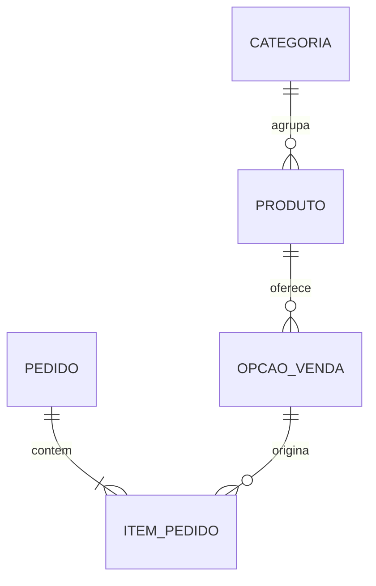

# Modelagem inicial — proposta para implementação

## Fluxo do pedido

1. O cliente consulta o catálogo e monta a cesta.
2. Informa nome, telefone, escolhe entrega ou retirada e a forma de pagamento (cartão, Pix ou dinheiro).
3. Para entrega, informa o endereço.
4. O servidor valida opções e quantidades, consulta os preços atuais e calcula os valores. Valores enviados pelo navegador não são a fonte do preço.
5. Pedido e itens são gravados juntos, em uma transação. Se um item falhar, nenhum pedido incompleto é salvo.
6. Uma página exibe o número do pedido e um botão para abrir o WhatsApp com a mensagem preparada.
7. O vendedor confirma disponibilidade, entrega e valor final com o cliente, e atualiza o status no painel.

Abrir o WhatsApp não comprova o envio da mensagem. O pedido nasce como pendente de confirmação e fica acessível ao vendedor mesmo se o cliente não enviar a mensagem. O fluxo deve permitir tentar abrir o WhatsApp novamente sem criar outro pedido.

## Entidades

### Categoria

- `id`: chave primária, identifica o registro.
- `nome`: nome único, como folhagens ou legumes.

### Produto

- `id`: chave primária.
- `categoria_id`: chave estrangeira para Categoria.
- `nome`, `descricao`, `foto`.
- `ativo`: controla a presença no catálogo.

Uma categoria pode ter vários produtos. Cada produto pertence a uma categoria nesta primeira versão.

### OpcaoVenda

- `id`: chave primária.
- `produto_id`: chave estrangeira para Produto.
- `unidade`: `MACO` ou `KG`.
- `preco`: decimal com duas casas, maior que zero, em reais por maço ou por kg.
- `disponivel`: permite suspender a venda dessa opção.

Um produto pode ter várias opções. A combinação de produto e unidade deve ser única: não cadastrar duas opções por kg para o mesmo produto.

### Pedido

- `id`: chave primária interna.
- `numero`: referência única legível para atendimento.
- `nome_cliente`, `telefone_cliente`.
- `modalidade`: `ENTREGA` ou `RETIRADA`.
- `forma_pagamento`: `CARTAO`, `PIX` ou `DINHEIRO`.
- `cep`, `logradouro`, `numero_endereco`, `complemento`, `bairro`, `cidade`, `uf`, `referencia`: dados de entrega; obrigatoriedade de cada campo será definida conforme a região atendida.
- `observacoes`.
- `status`: inicialmente `PENDENTE`; proposta de outros estados: `CONFIRMADO`, `CONCLUIDO`, `CANCELADO`.
- `subtotal_produtos`: decimal com duas casas.
- `taxa_entrega`: decimal com duas casas, não negativa; nula quando ainda não definida, diferente de zero (gratuita).
- `criado_em`, `atualizado_em`.

Proposta para simplificar a primeira versão: não exigir conta do cliente. Nome e contato ficam no pedido. Isso ainda permite adicionar um cadastro de clientes no futuro.

A taxa de entrega será combinada com o cliente pelo WhatsApp, sem cálculo automático de frete na primeira versão. Para entrega, o pedido nasce com `taxa_entrega` nula. A tela de resumo e a mensagem preparada para o WhatsApp mostram o subtotal dos produtos e “Entrega a combinar pelo WhatsApp”, sem apresentar esse subtotal como total final.

Depois do acordo, o vendedor registra a taxa no painel; zero significa entrega gratuita, enquanto nulo significa valor ainda não definido. Para retirada, a taxa é zero. Quando a taxa estiver definida, o valor com entrega corresponde ao subtotal dos produtos mais a taxa. Diferenças na pesagem real não alteram o valor dos produtos solicitado pelo cliente.

O pedido registra a forma de pagamento escolhida e a inclui na mensagem para o WhatsApp. Selecionar cartão, Pix ou dinheiro não significa que o pedido foi pago. Nesta primeira versão, o pagamento ocorre fora do site, sem integração com operadora de cartão ou geração automática de cobrança Pix. Não coletar dados de cartão no pedido.

### ItemPedido

- `id`: chave primária.
- `pedido_id`: chave estrangeira para Pedido.
- `opcao_venda_id`: chave estrangeira para OpcaoVenda.
- `nome_produto`: cópia do nome no momento do pedido.
- `unidade`: cópia da unidade no momento do pedido.
- `preco_unitario`: cópia do preço no momento do pedido, decimal com duas casas.
- `quantidade`: quantidade solicitada pelo cliente, decimal com três casas, maior que zero; não é substituída pelo peso real da separação.
- `subtotal`: quantidade multiplicada pelo preço, arredondada para centavos segundo uma regra explícita.

Um pedido contém um ou mais itens. Maços aceitam somente quantidades inteiras. Na venda por quilo, o cliente escolhe qualquer peso positivo, sem porções fixas. A precisão técnica proposta é de 1 g, representada por três casas decimais em kg. Por exemplo, 300 g são armazenados como 0,300 kg.

O preço é proporcional ao peso: R$ 10,00/kg multiplicados por 0,300 kg resultam em R$ 3,00. Proposta de cálculo: usar Decimal, arredondar cada subtotal para centavos com ROUND_HALF_UP e somar os subtotais dos itens. Rejeitar peso zero, negativo ou com precisão inferior a 1 g, sem arredondar silenciosamente o peso solicitado.

## Relacionamentos

A cobrança fica fixada pelo peso solicitado e pelo preço unitário registrado no item. Exemplo: a R$ 10,00/kg, um pedido de 500 g custa R$ 5,00; se a separação resultar em 520 g, o item continua custando R$ 5,00. Esta regra mantém a escolha livre de peso, sem criar porções fixas no catálogo. Não é necessário registrar o peso real nesta primeira versão.

## Por que copiar nome, unidade e preço para o item?

O catálogo representa a oferta atual. O item representa o que foi solicitado naquele momento. Se o preço do maço mudar amanhã, o pedido antigo deve manter seu preço original. Essa duplicação é intencional para preservar o histórico.

## Regras para o desenvolvimento

- Usar `Decimal` para dinheiro e peso, não `float`.
- Validar regras no servidor, mesmo que também existam validações na tela.
- Proteger produtos e opções referenciados em pedidos contra exclusão; desativar ofertas antigas.
- Recalcular valores no servidor e tratar alteração de preço durante a compra antes da confirmação pelo cliente.
- Proteger a criação contra duplicidade em reenvios e cliques repetidos.
- Acesso a dados pessoais e gerenciamento de pedidos exigem autenticação do vendedor. Número de pedido não deve dar acesso público a nome, telefone e endereço.
- Disponibilidade manual é a proposta inicial. Controle de estoque por peso, compras e perdas não está definido no escopo.
- Pagamento online não faz parte do fluxo acordado; pedidos são confirmados pelo vendedor no WhatsApp.

## Decisões ainda necessárias

- Entrega definida: somente Ji-Paraná/RO; taxa combinada conforme o endereço.
- Instruções de pagamento que aparecerão no pedido, se necessárias (por exemplo, momento do pagamento).

## Exercício de compreensão

Imagine uma couve vendida por maço e por kg. Ela terá um registro em Produto e dois em OpcaoVenda. Quando um cliente pede dois maços, ItemPedido aponta para a opção por maço e guarda uma cópia de seu preço. Explique por que mudar o preço do catálogo não deve atualizar esse item.
